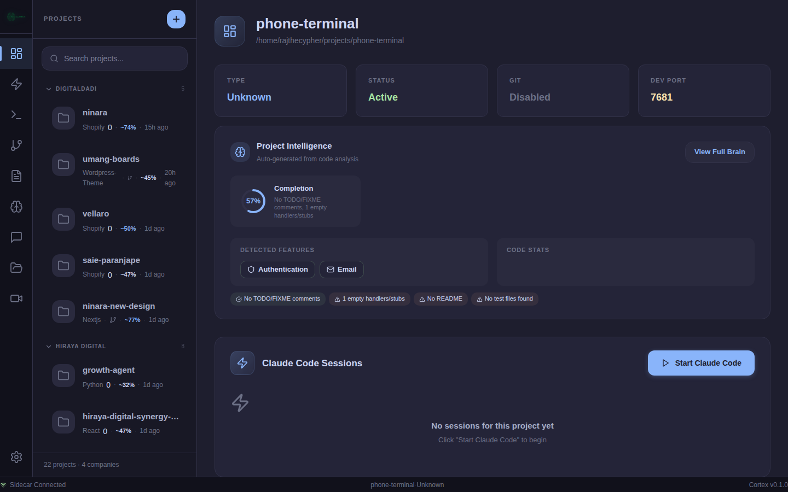
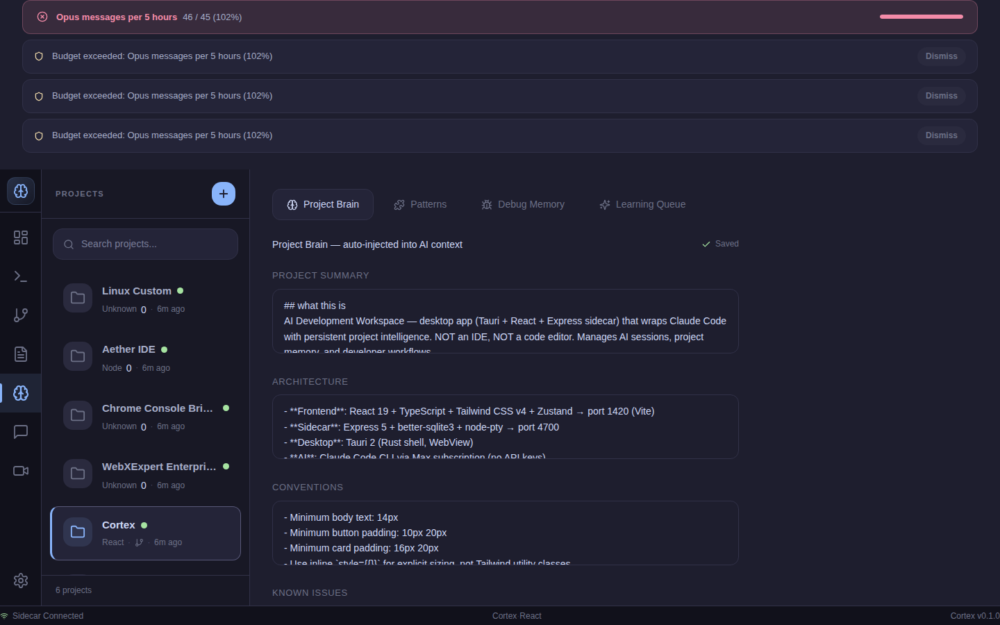
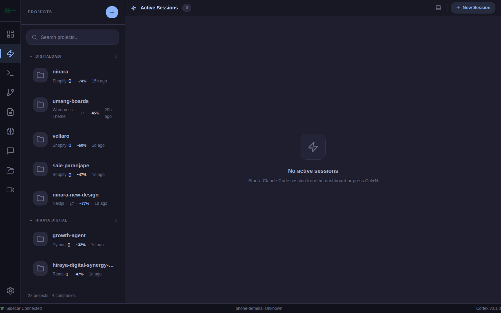
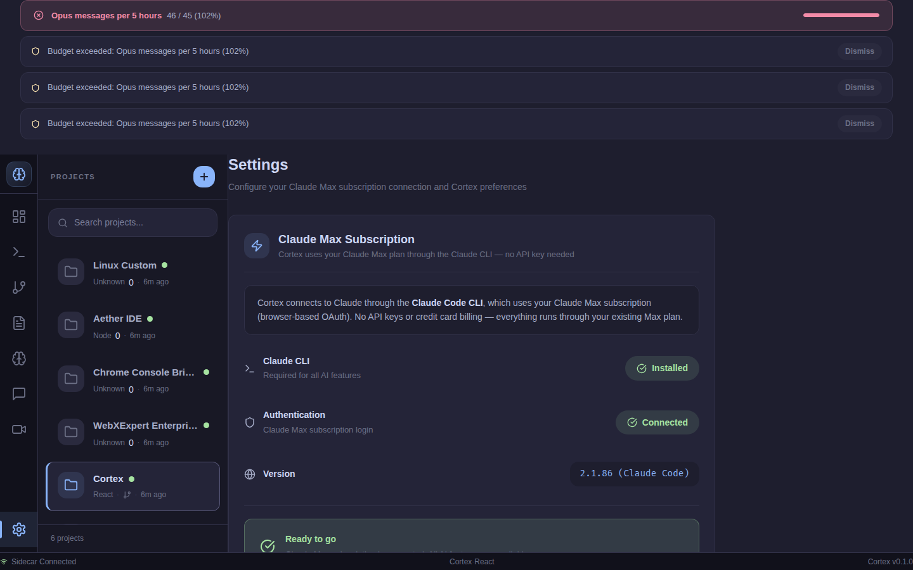

<p align="center">
  
</p>

<h1 align="center">Cortex</h1>

<p align="center">
  <strong>AI Development Workspace for developers who ship with AI, not just chat with it.</strong>
</p>

<p align="center">
  Every project gets a persistent AI brain. Every Claude Code session has a name.<br/>
  Every bug you've solved is remembered. Every context switch is instant.
</p>

<p align="center">
  <a href="https://claude.ai/code"></a>
</p>

<p align="center">
  <a href="#-quick-start"></a>
  <a href="LICENSE"></a>
  <a href="#-tech-stack"></a>
  <a href="#-tech-stack"></a>
  <a href="#-tech-stack"></a>
  <a href="#-tech-stack"></a>
</p>

<p align="center">
  <a href="#tldr">TL;DR</a> &middot;
  <a href="#screenshots">Screenshots</a> &middot;
  <a href="#features">Features</a> &middot;
  <a href="#quick-start">Quick Start</a> &middot;
  <a href="#architecture">Architecture</a> &middot;
  <a href="#why-this-matters-for-claude-code-users">Why It Matters</a> &middot;
  <a href="#contributing">Contributing</a>
</p>

---

## TL;DR

Cortex is a Linux desktop app that adds:

- **Named Claude Code sessions** — no more anonymous "Terminal 3"
- **Persistent project intelligence** — AI remembers your architecture, patterns, and past bugs
- **AI usage tracking per project** — prompts, tokens, sessions, exportable for billing
- **Error intelligence** — browser + server errors auto-captured and matched to known solutions
- **Context injection** — project brain assembled and injected before every AI session
- **Budget guardrails** — rate limit monitoring for Claude Max subscriptions

All stored locally using SQLite. No cloud. No telemetry.

---

## Built With Claude Code

This project was developed primarily using **Claude Code** with a **Claude Max** subscription. 12,000+ lines across 90+ files, 35 database tables, 70+ API endpoints, an MCP server with document generation tools, a Chrome extension, and 9 phases of intelligence features. Cortex is both a tool for Claude Code users and a testament to what Claude Code can ship.

---

## Screenshots

### Session Dashboard


### Project Intelligence Panel


### AI Session Monitor


### Budget Guard & Settings


---

## The Problem

You're an agency dev running Claude Code across 8 client projects. Here's your reality:

- **No session identity** — "Terminal 3" is running a refactor, but you forgot which project
- **No memory** — Claude doesn't know your auth module uses JWT, not sessions. Again.
- **No usage tracking** — client asks "how much AI did you use?" and you shrug
- **No error intelligence** — you solved that `null ref` bug last month. Now it's back. You solve it again.
- **Context switch = context loss** — switch projects, lose everything

**You're paying for the most powerful AI coding assistant and managing it with `Ctrl+Tab` and hope.**

## The Solution

Cortex is a desktop app that wraps Claude Code (and any AI provider) with persistent project intelligence. It doesn't replace your editor. It manages the AI layer your editor doesn't have.

```
You today:                          You with Cortex:

Terminal 1: claude (which project?) ──► refactor-auth (client-portal) Running
Terminal 2: claude (what context?)  ──► debug-api (saas-backend) Idle
Terminal 3: claude (what did it do?)──► setup-ci (mobile-app) Done ✓

"How much AI did I use?"            ──► Today: 47 prompts · ~35k tokens · $0.42
"What was that bug fix?"            ──► Auto-matched: JWT expiry race condition
"What's the architecture?"          ──► Brain: NestJS + Prisma + Redis, deployed on Fly.io
```

---

## Features

### Named Claude Code Sessions

The feature that doesn't exist anywhere else.

Every Claude Code session gets a name, a project, and a persistent identity. See all running sessions across all projects in one dashboard. Monitor what AI is doing in Project A while you work in Project B.

| What | How |
|---|---|
| Named sessions | `refactor-auth`, not "Terminal 3" |
| Cross-project dashboard | See every active AI session at a glance |
| Usage tracking | Prompts, tokens, cost — per session, per project, per day |
| CSV export | Bill clients for exact AI usage |
| Session resume | Reopen project, pick up where Claude left off |

### Per-Project AI Brain

When you add a project, Cortex **automatically scans it** — reads your package.json, detects the framework, maps the file structure, and populates the project brain. AI knows your architecture before you type a single prompt.

| Brain Field | Auto-Populated From |
|---|---|
| Summary | package.json, CLAUDE.md, README — with completion estimate |
| Architecture | Framework detection, sub-projects, ports, routes, databases, **servers, SSH, deploy info** |
| Conventions | tsconfig, eslint, prettier — scanned in root **and sub-projects** |
| Dependencies | Key deps from root + all sub-project package.json/composer.json/requirements.txt |
| Decisions | CLAUDE.md content, deploy docs, NEXT_SESSION_PROMPT.md, env variables |
| File Index | 2000+ files classified: controllers, routes, models, components, tests |

**Deep docs scanning**: Reads CLAUDE.md, README, deploy docs, Claude memory files, and NEXT_SESSION_PROMPT.md to extract server IPs, SSH details, deployment URLs, setup commands, and API key names.

**Toolchain detection**: Auto-detects CLI tools (Shopify CLI, WP-CLI, Docker), SSH connections, and deploy methods (SSH, Vercel, GitHub Actions).

**Completion estimation**: Scores 0-100% based on TODO/FIXME count, empty handlers, test coverage, README/LICENSE presence, CI config, and feature count.

Brain fields are auto-filled on project add, but **never overwritten** — your manual notes always take priority.

### Intelligence That Compounds

The more you use Cortex, the smarter it gets.

- **Pattern Memory** — save reusable code patterns with tags and confidence scoring. Search across all projects. `Verified` / `Probable` / `Unverified` tiers based on usage + rating.
- **Debug Memory** — store bug solutions with error signatures. When the same error appears again (in any project), the solution surfaces automatically. Zero manual lookup.
- **Background Worker** — runs on idle: prunes old snapshots, compresses history, auto-promotes patterns based on usage data.

### Real-Time Error Intelligence

Powered by [claude-console-bridge](https://github.com/AetheriumDev/claude-console-bridge):

- Browser errors captured via Chrome extension, auto-routed to the correct project by port
- Known errors instantly surface existing solutions from debug memory
- Error context injected into your active Claude Code session
- Error signatures normalized for fuzzy matching across projects

### AI Execution Policy

Not all AI actions are safe. Cortex blocks dangerous commands by default.

| Tier | Actions | Behavior |
|---|---|---|
| **Allowed** | `git status`, `pnpm test`, file reads | Executes immediately |
| **Restricted** | `rm -rf`, `sudo`, `DROP TABLE`, `chmod 777` | Blocked. Always. |
| **Approval** | `git push`, package installs, DB migrations | Paused. User confirms. |

Per-project overrides supported. Every policy decision is logged.

### Playbooks

Reusable step-by-step workflows for repetitive tasks:

```json
{
  "name": "New Feature Setup",
  "steps": [
    { "type": "command", "action": "git checkout -b feature/{{name}}" },
    { "type": "ai_prompt", "action": "Create the boilerplate for {{description}}" },
    { "type": "checkpoint", "action": "Review generated code before continuing" },
    { "type": "command", "action": "pnpm test" }
  ]
}
```

### Context Injector (Phase 0)

Before every Claude Code session spawn, Cortex assembles a `.cortex-context.md` file:

- Priority-weighted source selection (brain > errors > patterns > server info)
- ~11,500 token default budget with per-project tuning via `context_priorities` table
- Truncation by priority — highest-value context always fits
- Includes Masterpiece Design Rules when enabled

### Budget Guard (Phase 1)

Rate limit monitoring for Claude Max subscriptions:

- **4 default limits**: Messages/5h (45), Hours/7d (167), Tokens/day (500K), Sessions/day (20)
- Warning banner at 80%, session spawn blocked at 100%
- Per-limit toggle, custom thresholds, progress bars in Settings
- Background job checks every 5 minutes, creates timestamped alerts

### Handoff Generator (Phase 2)

Auto-generates `NEXT_SESSION_PROMPT.md` when a session ends:

- Queries session_history, session_metrics, project_snapshots, debug_memory
- Outputs: file read order, session activity, git state, known issues, debug solutions, troubleshooting
- HandoffViewer component: markdown preview + copy to clipboard + regenerate
- "Handoff" button on completed session cards

### Auto-Learning Pipeline (Phase 3)

Automatically populates intelligence from session activity:

- **Session Analyzer** — parses output for error signatures (10+ regex patterns), file changes, repeated code blocks
- Creates `unverified` entries in debug_memory and pattern_memory
- **Learning Queue UI** — approve/dismiss with human-in-the-loop gating
- Background worker auto-analyzes recently completed sessions

### Masterpiece Mode (Phase 4)

Toggle in Settings that injects award-worthy design philosophy into every AI interaction:

- Lenis smooth scroll, GSAP + ScrollTrigger animations, Catppuccin palette
- Desktop-quality UI standards, structured build phases, pre-commit hard gates
- Injected into chat system prompt and `.cortex-context.md`

### MCP Server + Document Builder (Phase 5)

Cortex exposes intelligence and document generation to Claude Code via Model Context Protocol:

- **Intelligence tools** (port 4710): `get_project_brain`, `search_patterns`, `match_error`, `get_file_index`, `get_server_info`, `get_context`
- **Document tools** (global, no per-project install): `create_docx`, `create_pdf`, `create_spreadsheet`, `read_docx`, `read_pdf`
- **Client**: Connects to external MCP servers (console-bridge, etc.)

The Document Builder MCP means Claude can generate Word docs, PDFs, and spreadsheets from **any project** without installing `docx`, `pdfkit`, or `exceljs` locally.

### Chrome Extension (Phase 6)

`cortex-chrome-bridge` — Manifest V3:

- Content script intercepts `console.error`, `console.warn`, unhandled errors, failed fetch/XHR
- Background service worker bridges to sidecar via WebSocket (fallback: HTTP)
- Popup UI with connection status and queue counts

### Remotion Studio (Phase 7)

Programmatic video rendering from project data:

- One-click render using Project Brain as video props
- Progress tracking, video preview, download
- ActivityBar icon for quick access

### Drag & Drop + File Attachment (Phase 8)

- Drop files into chat input to attach their contents
- File pills with name, size, remove button
- Contents included in AI messages (up to 50KB per file)

### Everything Else

- **Terminal Engine** — node-pty + xterm.js, tabbed, 4 types (shell / AI session / dev server / git)
- **Git Panel** — live branch, status, diff viewer, commit log, pull/push
- **Markdown Notes** — per-project with 1s debounced autosave
- **Task Tracker** — click-to-cycle: Pending → Doing → Done → Blocked
- **Reference Intelligence** — version-pinned tool commands, breaking change log, deprecated API tracking
- **Workspace Resume** — close Cortex, reopen, everything is exactly where you left it
- **Project Icons** — per-project emoji or image icons in sidebar and dashboard
- **9 workspace tabs** — Overview, Terminal, Git, Notes, Brain, AI Chat, Remotion Studio, Settings

---

## Quick Start

> Cortex is in alpha. These instructions are for contributors and early testers.

### Prerequisites

- Linux (Ubuntu 22.04+, Pop!_OS, Fedora 38+)
- Node.js 20+ (recommend 22 LTS)
- Rust (latest stable via [rustup](https://rustup.rs))
- pnpm 9+

### Install & Run

```bash
# Clone
git clone https://github.com/Promotix21/cortex.git
cd cortex

# Install frontend dependencies
pnpm install

# Install sidecar dependencies
cd sidecar && pnpm install && cd ..

# Start development (sidecar + Tauri + Vite)
cd sidecar && pnpm dev &     # Starts Express on :4700
cd .. && pnpm tauri dev       # Starts Tauri desktop app
```

### Build for Distribution

```bash
pnpm tauri build
# Outputs: .deb, .rpm, .AppImage in src-tauri/target/release/bundle/
```

### Project Structure

```
cortex/
├── src/                          # React frontend (30+ components)
│   ├── components/
│   │   ├── sidebar/              # Project list, search, add dialog
│   │   ├── workspace/            # Tabs: Overview, Git, Notes, Reference, Studio
│   │   ├── terminal/             # xterm.js terminal with tabs
│   │   ├── sessions/             # Dashboard, cards, usage, handoff viewer
│   │   ├── chat/                 # AI chat panel with streaming + file drop
│   │   ├── intelligence/         # Brain editor, patterns, debug, learning queue
│   │   ├── budget/               # Budget guard banner + settings
│   │   ├── remotion/             # Remotion studio UI
│   │   ├── settings/             # Settings panel + masterpiece toggle
│   │   └── bridge/               # Error capture panel
│   ├── stores/                   # Zustand (project, session, terminal, chat, budget, settings, nav)
│   ├── lib/                      # API client, utilities
│   └── types/                    # TypeScript interfaces
├── sidecar/                      # Express backend
│   └── src/
│       ├── db/                   # SQLite schema (35 tables) + connection
│       ├── routes/               # 15 route files, 70+ API endpoints
│       ├── sessions/             # Session manager, snapshots, execution history
│       ├── terminals/            # Terminal manager (node-pty)
│       ├── chat/                 # Claude CLI integration + masterpiece injection
│       ├── intelligence/         # Context injector, budget guard, handoff generator,
│       │                         # session analyzer, masterpiece context, file indexer,
│       │                         # project scanner, remotion renderer, background worker
│       ├── mcp/                  # MCP server (port 4710) + MCP client
│       └── bridge/               # Console bridge client
├── chrome-extension/             # Manifest V3 Chrome extension
│   ├── manifest.json             # Permissions and config
│   ├── background.js             # WebSocket/HTTP bridge to sidecar
│   ├── content.js                # Console + network error interception
│   └── popup.html/js             # Connection status UI
├── src-tauri/                    # Tauri (Rust) shell
└── assets/                       # Demo GIF, screenshots
```

---

## Architecture

```
┌──────────────────────────────────────────────────────────────────────┐
│                           TAURI SHELL (Rust)                          │
│                          Linux / WebView2                             │
├──────────────────────────────────────────────────────────────────────┤
│                                                                      │
│   ┌───────────────────────┐   HTTP :4700   ┌──────────────────────┐  │
│   │    React Frontend     │ ◄────────────► │   Express Sidecar    │  │
│   │                       │                │                      │  │
│   │  Sidebar + Icons      │                │  SQLite (35 tables)  │  │
│   │  9 Workspace Tabs     │                │  Session Manager     │  │
│   │  Session Dashboard    │                │  Terminal Manager    │  │
│   │  Budget Guard Banner  │                │  Context Injector    │  │
│   │  xterm.js Terminals   │                │  Budget Guard        │  │
│   │  AI Chat + File Drop  │                │  Handoff Generator   │  │
│   │  Intelligence + Queue │                │  Session Analyzer    │  │
│   │  Remotion Studio      │                │  Background Worker   │  │
│   │  Masterpiece Toggle   │                │  Remotion Renderer   │  │
│   └───────────────────────┘                └──────────┬───────────┘  │
│                                                       │              │
│   ┌─────────────────────┐            ┌────────────────▼───────────┐  │
│   │  MCP Server :4710   │            │  Console Bridge            │  │
│   │  6 JSON-RPC tools   │            │  WebSocket + HTTP fallback │  │
│   │  Claude Code ◄──────│            │  Chrome Extension ────────►│  │
│   └─────────────────────┘            └────────────────────────────┘  │
└──────────────────────────────────────────────────────────────────────┘
```

### Database: 35 SQLite Tables

| Group | Tables | Purpose |
|---|---|---|
| **Core** | projects, terminals, notes, tasks, workspace, ai_sessions | Project management |
| **Sessions** | claude_sessions, session_metrics, session_history, usage_daily | Session tracking + billing |
| **Intelligence** | project_brain, pattern_memory, debug_memory, file_index | AI memory layer |
| **Reference** | tools, tool_versions, commands, api_changes, project_tools | Version-aware docs |
| **Snapshots** | project_snapshots, execution_history, execution_groups | State capture + recovery |
| **Playbooks** | playbooks, playbook_runs | Reusable workflows |
| **Bridge** | captured_errors, captured_network | Error intelligence |
| **Budget** | budget_limits, budget_alerts | Rate limit guardrails |
| **Policy** | execution_policies, context_priorities | Safety + context control |
| **System** | background_jobs, file_locks, agent_tasks, settings | Background processing |

No ORM. No migrations. No cloud. All data lives in `~/.cortex/cortex.db`.

---

## Tech Stack

| Layer | Technology | Why |
|---|---|---|
| Desktop Shell | [Tauri 2](https://tauri.app) | Native Linux app, ~5MB binary, no Electron bloat |
| Frontend | React 19 + TypeScript + Vite 7 + Tailwind 4 + Zustand | Fast, typed, minimal bundle |
| Backend | Express 5 + better-sqlite3 + node-pty | Sidecar process, zero network exposure |
| Terminals | xterm.js + node-pty | Real PTY, not a web terminal emulator pretending |
| Git | simple-git | No shelling out, proper async git operations |
| AI | Claude Code CLI via Max subscription | No API keys — uses OAuth login |
| MCP | JSON-RPC server on port 4710 | Claude Code auto-discovers Cortex intelligence |
| Bridge | Chrome Extension (Manifest V3) | Console + network error capture |
| Theme | Catppuccin Mocha | Dark, easy on the eyes, VSCode-familiar |

---

## Who This Is For

**Agency developers** managing 5-10 client projects who need per-project AI usage tracking for billing.

**Freelancers** tired of losing Claude Code context every time they switch between clients.

**AI-native developers** who want their AI to remember architecture, past bugs, and coding patterns across sessions.

**Multi-repo engineers** who need one command center instead of 20 terminal tabs with anonymous AI sessions.

**Linux developers** who've been waiting for a proper AI development workspace that isn't Electron-based.

---

## What Cortex Is Not

- **Not a code editor** — it manages AI sessions and project intelligence, not editing. Use it alongside VSCode/Neovim.
- **Not cloud-based** — everything is local. No accounts. No telemetry. Your code never leaves your machine.
- **Not an AI wrapper** — it doesn't compete with Claude or GPT. It makes them remember.

---

## Why This Matters for Claude Code Users

Claude Code is powerful but currently lacks:

- **Multi-project orchestration** — no way to manage sessions across projects
- **Persistent project intelligence** — context is lost when you close the terminal
- **Usage tracking per project** — no billing data, no quota visibility
- **Session ownership** — sessions are anonymous processes, not named entities
- **Error-to-AI pipeline** — browser errors don't flow into AI context automatically

Cortex provides the missing infrastructure layer. It doesn't replace Claude Code — it makes Claude Code production-ready for developers managing real workloads across multiple projects.

---

## Status

**Alpha** — active development. Linux-first release targeted.

Core features are functional. 46/46 API endpoint tests passing. TypeScript strict mode, 0 errors. Testing and hardening in progress.

---

## Contributing

We welcome contributions. Cortex is MIT-licensed.

```bash
# Development workflow
pnpm install && cd sidecar && pnpm install && cd ..

# Run sidecar (backend)
cd sidecar && pnpm dev

# Run frontend (separate terminal)
pnpm tauri dev

# Type check
cd sidecar && pnpm exec tsc --noEmit   # Backend
pnpm exec tsc --noEmit                  # Frontend

# Build
pnpm exec vite build                    # Frontend only
pnpm tauri build                        # Full app
```

### Areas Looking for Help

- **Terminal reliability** — node-pty edge cases, Unicode handling, large output buffering
- **Context assembly optimization** — smarter token budgeting and source scoring
- **macOS / Windows ports** — Tauri supports them, we just haven't tested
- **Plugin API** — extension system for custom intelligence sources
- **UI polish** — animations, transitions, responsive layout tuning

---

## Roadmap

### Shipped
- [x] 12-phase core implementation (Foundation through Polish)
- [x] 70+ API endpoints, 35 database tables, 30+ components
- [x] 9 workspace tabs fully functional
- [x] Project auto-scan with brain population
- [x] Background intelligence worker
- [x] AI execution policy engine
- [x] Context Injector — auto-assembles `.cortex-context.md` before every session
- [x] Budget Guard — rate limit monitoring for Claude Max
- [x] Handoff Generator — auto-generates `NEXT_SESSION_PROMPT.md` on session end
- [x] Auto-Learning Pipeline — session analyzer + learning queue UI
- [x] Masterpiece Mode — design philosophy injection toggle
- [x] MCP Server — 6 tools, Claude Code auto-discovers intelligence
- [x] Chrome Extension — console + network error capture
- [x] Remotion Studio — programmatic video rendering
- [x] Drag & Drop file attachment in chat
- [x] Project icons (emoji + custom image)

### Next
- [ ] Tauri AppImage / .deb / .rpm packaging
- [ ] File watcher for live index updates
- [ ] Chat summarization (condense long conversations)
- [ ] Keyboard shortcuts and command palette
- [ ] Multi-model routing for specialized tasks
- [ ] Per-project billing export (CSV/JSON)

### Later
- [ ] Vector search (ChromaDB) for semantic pattern matching
- [ ] Local model support via Ollama
- [ ] AI Orchestrator (multi-agent pipelines)
- [ ] Community playbook sharing
- [ ] macOS + Windows support
- [ ] Plugin API for custom intelligence sources

---

## Design Constraints (by design)

| Constraint | Reason |
|---|---|
| **Local only** | Your code, your data, your machine. No cloud dependency. |
| **No microservices** | One Express sidecar. One SQLite file. Ship fast, debug easy. |
| **No Electron** | Tauri is 10x lighter. Native performance matters for a tool you run all day. |
| **Linux first** | That's where the serious AI-assisted development is happening. |
| **SQLite, not Postgres** | Zero setup. Copy one file to back up everything. |
| **Express 5, not tRPC** | REST is debuggable with curl. When you're building infrastructure, simplicity wins. |

---

## Stats

```
Source files:    85+ (.ts + .tsx + .js)
Total lines:    ~10,000+
API endpoints:  70+
DB tables:      35
React components: 30+
Zustand stores:   7
MCP tools:        6
Chrome Extension: Manifest V3
Build time:     2.3s (Vite)
```

---

## License

MIT. Use it, fork it, ship it.

---

<p align="center">
  <strong>Cortex — the AI development workspace that remembers everything.</strong>
  <br/><br/>
  Built by <a href="https://github.com/Promotix21">Rajesh Kumar</a> at <a href="https://hiraya.digital">Hiraya Digital</a>
  <br/>
  <sub>Developed primarily with Claude Code + Claude Max. If this is useful, star the repo.</sub>
</p>
