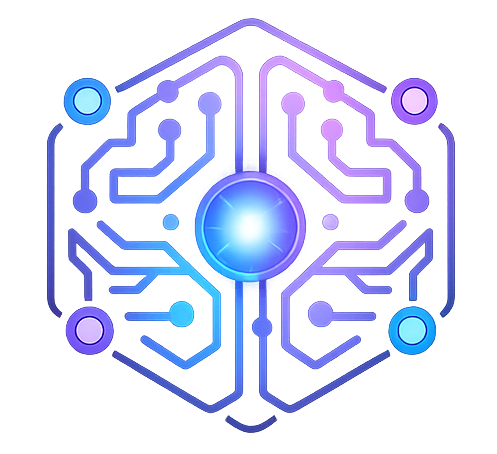

<p align="center">
  
</p>

<h1 align="center">Cortex</h1>

<p align="center">
  <strong>The AI-Native Developer Command Center.</strong>
</p>

<p align="center">
  Every project gets a persistent brain. Every session has a name.<br/>
  Multi-model orchestration. 20-turn threading. Zero context loss.
</p>

<p align="center">
  <a href="https://claude.ai/code"></a>
</p>

<p align="center">
  <a href="#-quick-start"></a>
  <a href="LICENSE"></a>
  <a href="#-tech-stack"></a>
  <a href="#-tech-stack"></a>
  <a href="#-tech-stack"></a>
  <a href="#-tech-stack"></a>
</p>

<p align="center">
  <a href="#tldr">TL;DR</a> &middot;
  <a href="#-whats-new">What's New</a> &middot;
  <a href="#features">Features</a> &middot;
  <a href="#architecture">Architecture</a> &middot;
  <a href="#collaborators--contributing">Collaborate</a>
</p>

---

## TL;DR

Cortex is a cross-platform (Linux & Windows) desktop application that serves as the mission control for AI-assisted development. It wraps your AI interactions in a layer of persistent project intelligence and multi-model orchestration.

- **Named AI Sessions** — Move from anonymous terminals to named identities (`refactor-auth`).
- **Multi-Provider Orchestration** — Seamlessly switch between **Anthropic**, **AWS Bedrock** (Claude 4.6), and **Mistral** (Devstral 2 123B).
- **Infinite Memory** — 20-turn conversation threading + AAAK-compressed project context.
- **Persistent Project Brain** — AI knows your architecture and past bug fixes across sessions.
- **Local-First** — Your code and secrets stay on your machine. Stored in local SQLite + Encrypted Vault.

---

## 🆕 What's New: Cross-Platform Orchestration

We just shipped a massive update to the Cortex intelligence layer:

*   **Initial Windows Support:** Cortex now runs natively on Windows with PowerShell/CMD terminal support and automatic Claude CLI discovery.
*   **AWS Bedrock Native:** High-capacity access to Claude 3.5 Sonnet and Claude 4.6 via AWS Bedrock.
*   **Devstral Support:** Mistral's massive 123B model (Devstral 2) integrated for high-logic reasoning tasks.
*   **Conversation Threading:** No more cold-starts. Cortex now threads the last 20 turns of history into every message.
*   **Context Explorer:** AI can now see your full project directory structure (via the `file_index` table).

---

## The Solution

Cortex manages the AI layer your editor doesn't have.

| You today: | You with Cortex: |
|---|---|
| **Rate limited** by Claude.ai | **Seamless fallback** to AWS Bedrock / Devstral |
| **Anonymous** terminal tabs | **Named sessions** with usage tracking |
| **Context switch = Loss** | **Persistent Brain** + **MemPalace** memory |
| **Hallucinating** old code | **20-turn history** + **AAAK Compression** |
| **Unsafe** AI commands | **Execution Policies** (Allowed/Restricted/Approval) |

---

## Features

### 1. Multi-Provider Orchestration
Don't be locked into one API. Switch providers in the TopBar or middle of a session.
- **Anthropic Native:** For the purest Claude experience.
- **AWS Bedrock:** For enterprise-grade reliability and Claude 4.6 support.
- **Mistral Devstral 2 (123B):** Powerful open-weights reasoning via Bedrock.
- **Provider Usage Tracking:** Real-time monitoring of tokens, latency, and cost per provider.

### 2. MemPalace & AAAK Intelligence
The more you use Cortex, the smarter it gets.
- **AAAK Compression:** AI-to-AI Knowledge format that reduces context tokens by 70%.
- **Temporal Knowledge Graph:** Tracks how your project decisions evolve over time.
- **Room-Aware Context:** UI, API, or Deploy—Cortex detects the "room" and injects only relevant patterns.
- **Build Memory:** One-click scan to refresh your AI's understanding of the codebase.

### 3. Named Claude Code Sessions
Organize your work by intent. Every session tracks its own history, tokens, and git state.
- **Session Resume:** Pick up any task exactly where you left off.
- **Handoff Generator:** Automatically creates `NEXT_SESSION_PROMPT.md` when a session ends.
- **Usage Tracking:** Export detailed AI usage reports for client billing.

### 4. Enterprise-Grade Security
- **Vault:** Encrypted local storage for AWS keys and API credentials.
- **Local-First:** SQLite database with zero telemetry. Your data never leaves your machine.
- **Execution Policies:** Hard gates for dangerous commands (e.g., blocking `rm -rf` or `DROP TABLE`).

---

## Architecture

Cortex is built for performance and security using a sidecar architecture.

```
┌──────────────────────────────────────────────────────────────────────┐
│                           TAURI SHELL (Rust)                          │
│                          Linux / Windows                              │
├──────────────────────────────────────────────────────────────────────┤
│                                                                      │
│   ┌───────────────────────┐                  ┌──────────────────────┐  │
│   │    React Frontend     │ ◄──────────────► │   Express Sidecar    │  │
│   │ (Zustand + Tailwind)  │                  │ (SQLite + node-pty)  │  │
│   └───────────────────────┘                  └──────────┬───────────┘  │
│                                                         │              │
│   ┌─────────────────────┐            ┌──────────────────▼───────────┐  │
│   │  MCP Server :4710   │            │  Multi-Provider Orchestrator │  │
│   │  22 AI-Ready Tools  │            │  (Bedrock / Anthropic / Dev) │  │
│   └─────────────────────┘            └──────────────────────────────┘  │
└──────────────────────────────────────────────────────────────────────┘
```

---

## Collaborators & Contributing

We are building the open-source infrastructure for the AI-assisted era. Cortex is a deep-tech project (20k+ lines, 35+ tables) and we are looking for contributors who love building high-performance developer tools.

### Why Contribute?
- **Advanced AI Integration:** Work with MCP (Model Context Protocol), custom compression algorithms (AAAK), and multi-provider routing.
- **Masterpiece Standards:** We follow high-end design principles—GSAP animations, smooth scrolling, and strict TypeScript safety.
- **Local-First Dev:** Help us push the boundaries of Tauri 2 and high-performance sidecar architectures.

### Areas for Help
- **MemPalace UI:** Help us build the visual room explorer and decision timeline.
- **New Providers:** Add support for OpenRouter, Ollama, or Azure OpenAI.
- **Terminal UX:** Optimizing `xterm.js` for high-throughput AI logs.
- **macOS support:** We are targeting macOS next!

Check out [CLAUDE.md](CLAUDE.md) for our coding standards.

---

<p align="center">
  <strong>Cortex — Ship faster with the AI command center that remembers.</strong>
  <br/><br/>
  Built by <a href="https://github.com/Promotix21">Rajesh Kumar</a> at <a href="https://hiraya.digital">Hiraya Digital</a>
  <br/>
  <sub>Developed primarily with Claude Code + Claude Max. Star the repo to support open-source AI infrastructure.</sub>
</p>
